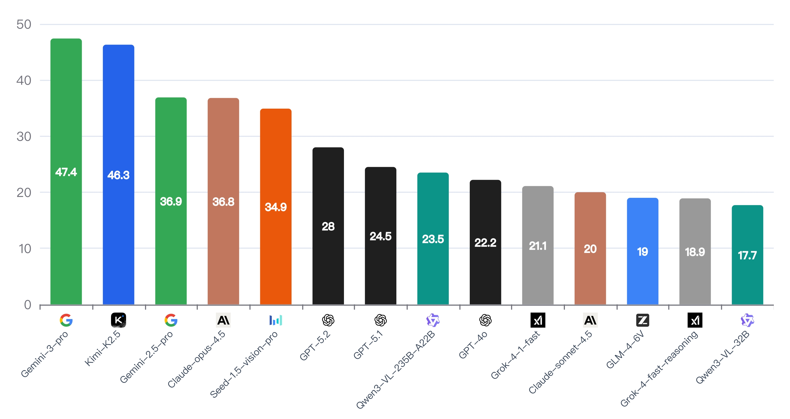
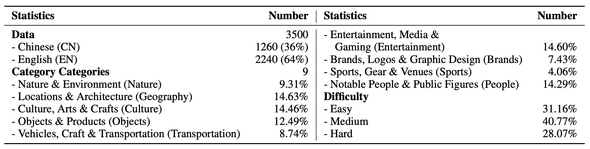
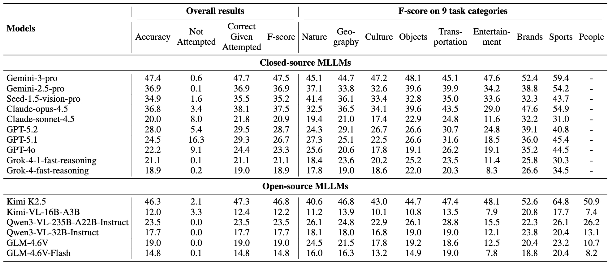

# WorldVQA
## WorldVQA: Measuring Atomic World Knowledge in Multimodal Large Language Models

[ HomePage](https://worldvqa2026.github.io/WorldVQA/) | [🤗 Dataset](https://huggingface.co/datasets/moonshotai/WorldVQA) | [ Paper](https://arxiv.org/abs/2602.02537v1) | [ Code](https://github.com/MoonshotAI/WorldVQA/)




## Abstract
We introduce WorldVQA, a benchmark designed to evaluate the atomic vision-centric world knowledge of Multimodal Large Language Models (MLLMs). Current evaluations often conflate visual knowledge retrieval with reasoning. In contrast, WorldVQA decouples these capabilities to strictly measure "what the model memorizes." The benchmark assesses the atomic capability of grounding and naming visual entities across a stratified taxonomy, spanning from common head-class objects to long-tail rarities. We expect WorldVQA serves as a rigorous test for visual factuality, thereby establishing a standard for assessing the encyclopedic breadth and hallucination rates of current and next-generation frontier models.


## Details

**WorldVQA** is a meticulously curated benchmark designed to evaluate atomic vision-centric world knowledge in Multimodal Large Language Models (MLLMs). The dataset comprises **3,500 VQA pairs** across **9 categories**, with careful attention to linguistic and cultural diversity.




## Quick Start: Evaluate Your Model

We've made evaluating your model on WorldVQA incredibly simple! Just follow these steps:

### 1. Install Dependencies

```bash
git clone https://github.com/runjieovo/WorldVQA-code.git
cd WorldVQA-code
pip install -r requirements.txt
```

### 2. Configure Your API Key

Option A (Recommended): Set environment variable
```bash
export OPENAI_API_KEY="your-api-key-here"
```

Option B: Use a .env file
```bash
cp .env.example .env
# Edit .env with your API key and preferred model
```

Option C: Directly edit the config in `eval/eval.py`

### 3. Prepare Dataset

Ensure you have `WorldVQA.tsv` in the project root.

### Configuration Options

You can customize these via environment variables or in `eval/eval.py`:

| Setting | Default | Description |
|---------|---------|-------------|
| `OPENAI_API_KEY` | Required | Your API key |
| `MODEL_NAME` | `Kimi-K2.5` | Model to evaluate |
| `JUDGE_MODEL` | `gpt-oss-120b` | Model for judging answers |
| `MAX_RETRIES` | `3` | API retry attempts |

### 4. Run Evaluation

```bash
cd eval
python eval.py
```

That's it! Your results will be saved in the `results/` directory.

## Leaderboard

Our evaluation reveals significant gaps in visual encyclopedic knowledge, with no model surpassing the 50% accuracy threshold.

We show a mini-leaderboard here and please find more information in our paper or homepage.

### Overall Performance

The leaderboard below shows the overall performance on WorldVQA (first 8 categories, excluding "People" due to systematic refusal behaviors in closed-source models):



## Citation

If you find WorldVQA useful for your research, please cite our work:

```bibtex
@misc{zhou2026worldvqameasuringatomicworld,
      title={WorldVQA: Measuring Atomic World Knowledge in Multimodal Large Language Models}, 
      author={Runjie Zhou and Youbo Shao and Haoyu Lu and Bowei Xing and Tongtong Bai and Yujie Chen and Jie Zhao and Lin Sui and Haotian Yao and Zijia Zhao and Hao Yang and Haoning Wu and Zaida Zhou and Jinguo Zhu and Zhiqi Huang and Yiping Bao and Yangyang Liu and Y. Charles and Xinyu Zhou},
      year={2026},
      eprint={2602.02537},
      archivePrefix={arXiv},
      primaryClass={cs.CV},
      url={https://arxiv.org/abs/2602.02537}, 
}
```
